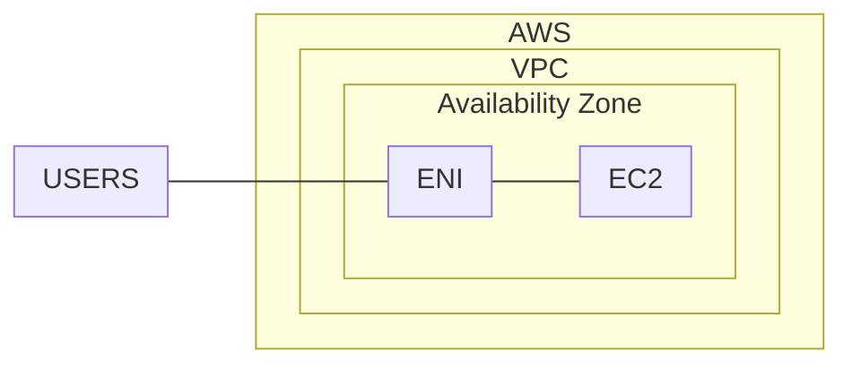

## Webserver deployment

This is a simple webserver deployment.

The componets of the deployments are utilizing the `generic-ec2` module.
This deployes an AmazonLinux 2 instance with an apache web server.
Users will connect directly to the hosting EC2 instance. 

